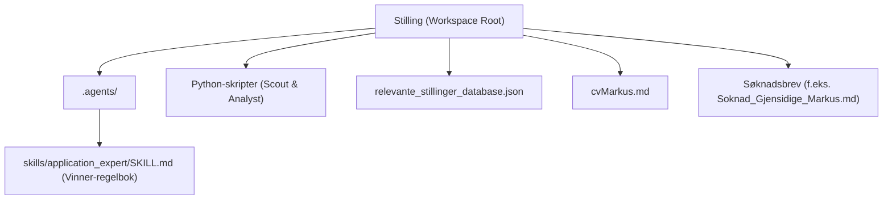
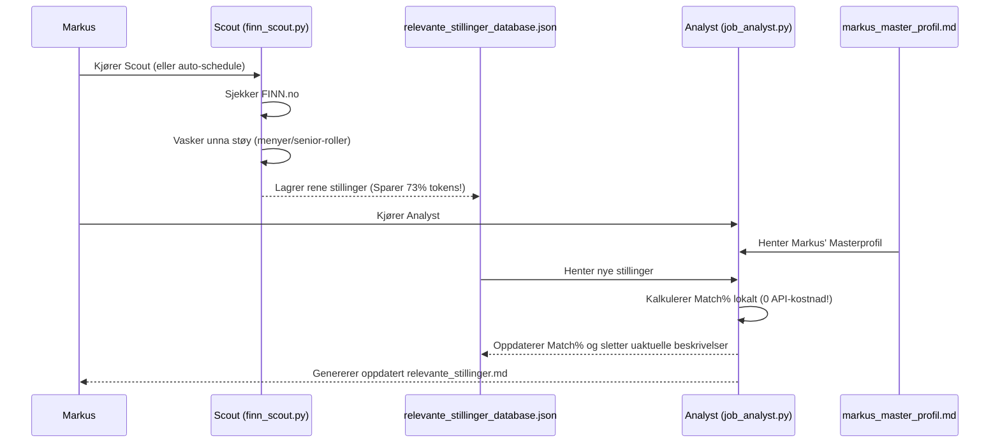

# 🚀 Brukermanual for Markus: Multi-Agent og Custom Skills i Antigravity

Hei Markus! Dette dokumentet forklarer nøyaktig hvordan det AI-drevne jobbsøkersystemet ditt er bygget opp i **Google Antigravity**, hvordan du gjenbruker filene som ligger i mappen din nå, og hvordan du tar fullt eierskap over prosessen videre.

---

## 🗺️ 1. Arkitekturen i ditt Antigravity-workspace

Ditt workspace (`/Users/markus/privatKoding/jobsknader`) er nå forberedt som et intelligent, AI-klart miljø. Her er oversikten over filene og mappene som styrer alt:



### De viktigste elementene:
1. **`.agents/skills/application_expert/SKILL.md` (Din faglige kjerne):** 
   Dette er den "intellektuelle motoren" i systemet ditt. Den inneholder de anonymiserte suksessmetodene (Aktiv profilering, Verdi-oversettelse, Akademisk stolthet, osv.) og dine to uovertrufne **Gullbilletter**.
2. **`cvMarkus.md` (Din master-CV):** 
   Din oppdaterte og optimaliserte CV som følger regelboken.
3. **`relevante_stillinger_database.json` & `relevante_stillinger.md` (Ditt marked):** 
   Din personlige database over aktive og relevante stillinger fra FINN.no, ferdig vasket og vurdert med match-prosent mot din profil.

---

## ⚡ 2. Slik gjenbruker og kjører du systemet i Antigravity

Antigravity er designet slik at det **automatisk oppdager** alt som ligger i `.agents`-mappen når du åpner mappen i verktøyet.

### Steg 1: Åpne mappen i Antigravity
Når du starter Antigravity (eller `agy` CLI-en), åpner du bare mappen:
```bash
# Åpne mappen i Antigravity via terminalen (om du bruker CLI)
agy open /Users/markus/privatKoding/jobsknader
```
*Eller velg mappen `Stilling` direkte i Antigravity-skrivebordsprogrammet.*

### Steg 2: Slik bruker du din Custom Skill
Når mappen er åpen, vet AI-en om din `application_expert`-skill. Du trenger ikke å laste den inn manuelt; den ligger klar i bakgrunnen.

Når du vil skrive en ny søknad eller tilpasse CV-en din til en ny stilling, skriver du bare dette i chatten til Antigravity:
> **Eksempel-promp:**
> *"Jeg vil søke på denne stillingen: [Lim inn URL eller stillingstekst]. Kan du aktivere skillen `application_expert` for å skrive en skreddersydd søknad for meg?"*

Antigravity vil da automatisk:
1. Lese instruksjonene i [`.agents/skills/application_expert/SKILL.md`](file:///Users/markus/privatKoding/jobsknader/.agents/skills/application_expert/SKILL.md).
2. Bruke 4-paragrafs formelen og fjerne alt av unskyldende eller passivt språk.
3. Strukturere søknaden rundt dine to Gullbilletter (Kulturminner og Kroa i Bø).
4. Generere en ferdig Markdown-fil for deg!

---

## 🤖 3. Slik fungerer Multi-Agent-oppsettet ditt

Gjennom denne prosessen har vi satt opp to spesialiserte roller: **Scout** og **Analyst**.



### Hvorfor er dette oppsettet unikt?
* **Token-optimalisering:** `finn_scout.py` henter ut kun den rene `description`-teksten direkte fra FINNs strukturerte JSON-LD-data. Alt av menyer, bannere og støy blir skrubbet bort. Dette reduserte databasen fra **460 KB til 123 KB (en besparelse på over 70 %!)**.
* **Kostnadsfritt:** Matching-algoritmen i `job_analyst.py` kjører lokalt ved bruk av smarte nøkkelordvektinger basert på din profil. Det betyr at du kan analysere 100-vis av stillinger helt gratis uten å bruke dyre API-tokens.

---

## 🛠️ 4. Slik kjører du skriftene i hverdagen

Skriptene ligger lagret i din `scratch`-mappe under Antigravitys app-data, men du kan enkelt flytte dem ut til rot-mappen din eller kjøre dem direkte:

### Slik kjører du Scout (Hente nye stillinger fra FINN):
Søket er konfigurert med den geografiske utvidelsen din (Nordre Follo, Ås, Drøbak, Lillestrøm – samt Oslo). 
```bash
# Kjører skriptet for å søke etter ferske stillinger
python3 /Users/markus/privatKoding/jobsknader/finn_scout.py
```

### Slik kjører du Analyst (Kalkulere match-skår og oppdatere listen):
```bash
# Kjører den lokale analysatoren
python3 /Users/markus/privatKoding/jobsknader/job_analyst.py
```

---

## 🌟 5. Hvordan eie og utvide prosessen videre (Markus' tips)

Når du nå eier prosessen selv, er det spesielt tre ting du enkelt kan gjøre for å utvide systemet:

### A. Legge til nye Gullbilletter
Hvis du tar et nytt sertifikat, bygger et kult hobbyprosjekt, eller lærer et nytt rammeverk, gjør du følgende:
1. Åpne [`markus_master_profil.md`](file:///Users/markus/privatKoding/jobsknader/markus_master_profil.md).
2. Legg det til under prosjekter eller ferdigheter.
3. Åpne [`.agents/skills/application_expert/SKILL.md`](file:///Users/markus/privatKoding/jobsknader/.agents/skills/application_expert/SKILL.md) og legg til en ny strategisk formulerings-mal for dette prosjektet under "Hovedressurser".

### B. Automatisere daglig søk (Schedules)
Du kan sette Antigravity til å kjøre disse søkene for deg automatisk hver morgen by å bruke `/schedule`-kommandoen i chatten:
> **Eksempel-promp til Antigravity:**
> *"/schedule run 'python3 [sti_til_finn_scout.py] && python3 [sti_til_job_analyst.py]' every morning at 08:00"*

Dette vil sette opp en bakgrunns-jobb som oppdaterer din [**`relevante_stillinger.md`**](file:///Users/markus/privatKoding/jobsknader/relevante_stillinger.md) med ferske og ferdig-skårede stillinger hver dag!

Lykke til, Markus! Du har nå et av markedets mest avanserte og optimaliserte AI-verktøy i ryggen!
